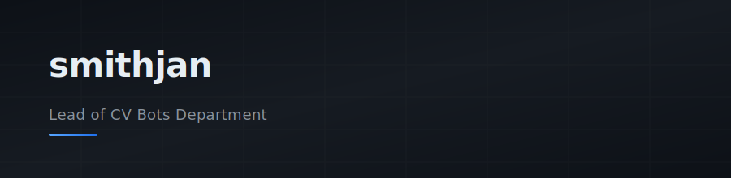

<picture>
  
</picture>

### Toolstack

 

### GitHub Stats

<picture>
  <source media="(prefers-color-scheme: dark)" srcset="https://github-readme-stats.vercel.app/api?username=sp-smithjan&show_icons=true&theme=github_dark&hide_border=true&bg_color=0d1117&title_color=58a6ff&icon_color=58a6ff&text_color=c9d1d9" />
  
</picture>

 

---

  
  &ensp;
  

